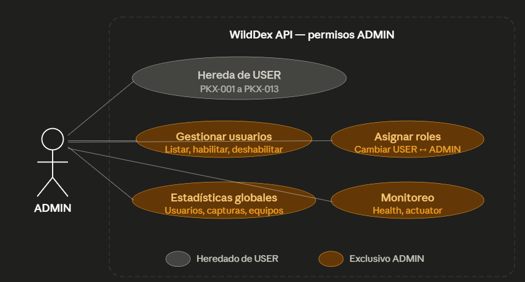
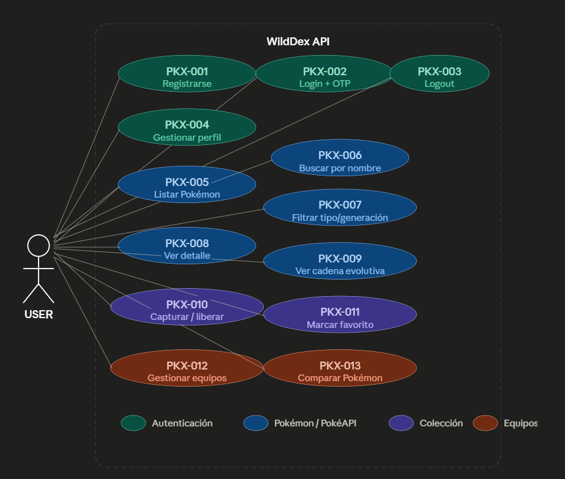

# Casos de uso — WildDex
 
## Rol: USER
 
### Autenticación y perfil
 
**PKX-001 — Registro de cuenta**
Como usuario no registrado, quiero crear una cuenta con nombre de usuario, correo electrónico y contraseña, para poder acceder a las funcionalidades de WildDex.
 
**PKX-002 — Inicio de sesión con verificación OTP**
Como usuario registrado, quiero iniciar sesión con mis credenciales y verificar mi identidad mediante un código OTP enviado a mi correo, para poder acceder de forma segura a mi cuenta.
 
**PKX-002b — Inicio de sesión con Google**
Como usuario, quiero iniciar sesión utilizando mi cuenta de Google/Gmail mediante OAuth2, para poder acceder sin necesidad de crear credenciales locales.
 
**PKX-003 — Cierre de sesión**
Como usuario autenticado, quiero cerrar mi sesión, para poder proteger mi cuenta al dejar de usar la aplicación.
 
**PKX-004 — Gestión de perfil**
Como usuario autenticado, quiero ver y actualizar mi nombre de usuario, imagen de perfil y contraseña, para poder mantener mi información personal actualizada.
 
### Exploración de Pokémon
 
**PKX-005 — Listado paginado de Pokémon**
Como usuario autenticado, quiero ver un listado paginado de Pokémon con su nombre, sprite y tipos, para poder explorar el catálogo completo de forma ordenada.
 
**PKX-006 — Búsqueda de Pokémon por nombre**
Como usuario autenticado, quiero buscar Pokémon escribiendo parte de su nombre, para poder encontrar rápidamente un Pokémon específico.
 
**PKX-007 — Filtrado de Pokémon por tipo y generación**
Como usuario autenticado, quiero filtrar Pokémon por tipo (fuego, agua, planta, etc.) o por generación, para poder explorar Pokémon que compartan características comunes.
 
**PKX-008 — Detalle completo de un Pokémon**
Como usuario autenticado, quiero ver la información completa de un Pokémon (stats, habilidades, descripción, altura, peso, región), para poder conocer todas sus características antes de capturarlo o agregarlo a un equipo.
 
**PKX-009 — Cadena evolutiva**
Como usuario autenticado, quiero ver la cadena de evolución de un Pokémon, para poder conocer sus formas previas y posteriores y planificar mi colección.
 
### Colección personal
 
**PKX-010 — Capturar y liberar Pokémon**
Como usuario autenticado, quiero capturar Pokémon para agregarlos a mi colección personal y poder liberarlos cuando lo desee, para poder gestionar mi Pokédex personal.
 
**PKX-011 — Marcar y desmarcar Pokémon favoritos**
Como usuario autenticado, quiero marcar Pokémon como favoritos y poder quitarlos de favoritos, para poder tener acceso rápido a los Pokémon que más me gustan.
 
### Equipos y comparación
 
**PKX-012 — Gestión de equipos Pokémon**
Como usuario autenticado, quiero crear, ver, editar y eliminar equipos de hasta 6 Pokémon con slots asignados, para poder organizar mis estrategias de combate.
 
**PKX-013 — Comparación de Pokémon**
Como usuario autenticado, quiero comparar las estadísticas de dos Pokémon lado a lado, para poder tomar mejores decisiones al armar mis equipos.
 
---
 
## Rol: ADMIN
 
El administrador hereda todos los casos de uso del rol USER y además cuenta con los siguientes:
 
### Gestión de usuarios
 
**ADM-001 — Listar usuarios del sistema**
Como administrador, quiero ver la lista completa de usuarios registrados, para poder monitorear el crecimiento y estado de la plataforma.
 
**ADM-002 — Habilitar o deshabilitar usuarios**
Como administrador, quiero habilitar o deshabilitar cuentas de usuario, para poder moderar el acceso a la plataforma cuando sea necesario.
 
**ADM-003 — Asignar roles**
Como administrador, quiero cambiar el rol de un usuario entre USER y ADMIN, para poder delegar responsabilidades administrativas.
 
### Monitoreo
 
**ADM-004 — Ver estadísticas globales**
Como administrador, quiero ver estadísticas globales del sistema (total de usuarios, capturas, equipos creados, Pokémon más populares), para poder entender el uso de la plataforma.
 
**ADM-005 — Monitoreo de salud del sistema**
Como administrador, quiero acceder a los endpoints de Actuator (health, info, metrics), para poder verificar que el sistema funciona correctamente.

# ADMIN 

# USER

